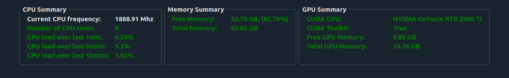

======================
Hardware Requirements
======================

Aydin tries to make use of high-end NVIDIA GPUs (Graphical Processing Units) whenever it can.
Some of the computational packages that Aydin depends on can make use of an
existing CUDA GPU out of the box (CatBoost) whereas other libraries
such as Numba require the CUDA toolkit to be installed
to be able to make use of CUDA GPUs. Aside from the CUDA GPU support, having a faster CPU with more cores
and a bigger memory can help with Aydin's runtime performance.

Recommended specifications are: at least 16 Gb of RAM, ideally 32 Gb, and more for very large
images, a CPU with at least 4 cores, preferably 16 or more, and a recent NVIDIA graphics card such as a RTX series card.
Older graphics cards could work but may cause trouble or be too slow. Aydin Studio's summary page
gives an overview of the strengths and weaknesses of your machine, highlighting in red and orange
items that might be problematic.

Apple Silicon (macOS)
~~~~~~~~~~~~~~~~~~~~~~

On Apple Silicon Macs (M1/M2/M3/M4), Aydin automatically uses the Metal Performance
Shaders (MPS) backend for PyTorch-based CNN denoisers. No additional setup is required
beyond installing PyTorch (included with Aydin).

Aydin conservatively uses up to 40% of available system memory for MPS operations, since
Metal's unified memory is shared between the GPU, the OS, and CPU-side arrays.

The FGR-based denoisers (CatBoost, LightGBM) run on CPU and benefit from Apple Silicon's
high core counts.

Modest hardware
~~~~~~~~~~~~~~~~~

Having said that, some algorithms in Aydin such as the 'Butterworth' denoiser  can be quite fast,
can run on modest machines, and may be sufficient for your needs.
