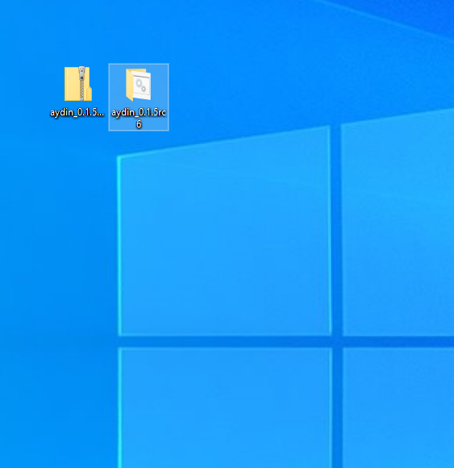

=============
Install Aydin
=============

You can install Aydin in two different ways.

First one is downloading the operating system specific bundles we have prepared.
This approach requires zero command-line interactions. It is as simple as downloading
Aydin bundle, installing/unzipping the bundle and double-clicking on Aydin icon
to start it.

Second approach is installing Aydin via ``pip``. With this approach, you will have
more flexible installation. It can be easier to set certain GPU-using dependencies in
this approach.

Below, we are giving detailed, step-by-step installation guides to help you installing
Aydin on your computer.

Install Aydin bundle on Mac OSX
---------------------------------------

Download the `OSX bundle <https://royerlab.github.io/aydin/>`_ to start. Then right-click and open the Aydin installer as shown
below:

You will be welcomed by the opening page of the installer, click on `Continue` button:

You can then choose the destination in which Aydin will be installed. On this step please
choose the partition that has your ``home`` folder, so that we can install Aydin into
your ``home`` folder for your convenience:

You are ready to start the installation, just click on `Install` button:

Installer will run and show you its progress as shown below:

Once the installation is done, you can close the installer:

After a successful installation, you can find ``Aydin`` in your ``Applications``
folder as shown below:

Install Aydin bundle on Windows
---------------------------------------

Download the `Windows bundle <https://royerlab.github.io/aydin/>`_ to start. Then extract the compressed
Aydin bundle, you should be able to see the see extracted folder as shown
below:

You can open the folder and double-click on the ``run-aydin`` file to start Aydin:

Install Aydin bundle on Linux
---------------------------------------

Download the `Linux bundle <https://royerlab.github.io/aydin/>`_  to start. Then extract the Aydin bundle
from the compressed file. You should be able to see the see extracted folder as shown below:

You can open the folder and run the ``run-aydin.sh`` script from terminal to start Aydin:

or you can get into ``aydin`` folder and double-click on the executable named ``aydin``:

Install Aydin in a Conda environment with CUDA support
---------------------------------------------------------------------

.. code-block:: bash

    $ conda create -y -n aydin_env python=3.9
    $ conda activate aydin_env
    $ pip install aydin
    $ conda install cudatoolkit
