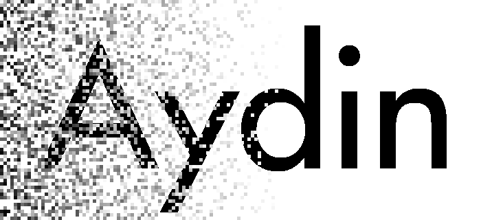

*Image denoising, but chill...*

Aydin is a user-friendly, feature-rich, and fast image denoising tool that provides
a number of self-supervised, auto-tuned, and unsupervised image denoising algorithms.
Aydin handles from the get-go n-dimensional array-structured images with an arbitrary number
of batch dimensions, channel dimensions, and typically up to 4 spatio-temporal dimensions.

It comes with `Aydin Studio` a `graphical user interface <https://royerlab.github.io/aydin/tutorials/gui_tutorials.html>`_
to easily experiment with all the different algorithms and parameters available,
a `command line interface <https://royerlab.github.io/aydin/tutorials/cli_tutorials.html>`_
to run large jobs offline, and an
`API <https://royerlab.github.io/aydin/api/introduction.html>`_ for
custom coding and integration into other packages.

Our GitHub repository can be found `here <https://github.com/royerlab/aydin>`_. You can
`open issues <https://github.com/royerlab/aydin/issues>`_ to communicate bug reports and
feature requests and find `our releases <https://github.com/royerlab/aydin/releases>`_.

Getting started, with bundles:
~~~~~~~~~~~~~~~~~~~~~~~~~~~~~~~~~
To get started with Aydin, please download and install Aydin on your machine.

.. raw:: html

    

       
       
       
    

     
     

Getting started, with pip:
~~~~~~~~~~~~~~~~~~~~~~~~~~~~~~~

Aydin is support only on Python 3.9 currently. You can install Aydin with the following line:

.. code-block:: bash

    pip install aydin

Requirements
~~~~~~~~~~~~~
While aydin works even on tiny laptops, it will run faster and better if you have
a Nvidia graphics card. We also recommend at least 16GB of RAM but more is better
especially for very large gigabyte-sized images. In the absence of a GPU,
the more CPU cores the better, obviously. Different algorithms have different performance
profiles, some of our best algorithms can easily run on modest machines, but you will need
patience.

Documentation
~~~~~~~~~~~~~~
Tutorials can be found `here <https://royerlab.github.io/aydin/tutorials/tutorials_home.html>`_
for an exhaustive tour of features and parameters for both
the graphical interface (Aydin Studio), command line interface (CLI), and
Python programming interface (API). To better understand how to tune parameters
for a given image, please check our `use cases <https://royerlab.github.io/aydin/use_cases/introduction.html>`_
where we go through.

How to cite?
~~~~~~~~~~~~~
If you find Aydin useful and use it in your work, please kindly consider to cite us:

.. image:: https://zenodo.org/badge/188953977.svg
   :target: https://zenodo.org/badge/latestdoi/188953977

.. toctree::
   :maxdepth: 1
   :hidden:
   :caption: Getting Started

   Install <getting_started/install.rst>
   Hardware Requirements <getting_started/hardware_requirements.rst>

.. toctree::
   :maxdepth: 1
   :hidden:
   :caption: Use Cases

   Introduction <use_cases/introduction.rst>
   Denoising Basics with Aydin <use_cases/basics.rst>
   Denoising Spinning-Disk Confocal Microscopy Images with Aydin <use_cases/confocal.rst>

.. toctree::
   :maxdepth: 1
   :hidden:
   :caption: Tutorials

   Tutorials Home <tutorials/tutorials_home.rst>
   Aydin Studio (GUI) Tutorials <tutorials/gui_tutorials.rst>
   Aydin CLI Tutorials <tutorials/cli_tutorials.rst>
   Aydin API Tutorials <tutorials/api_tutorials.rst>

.. toctree::
   :maxdepth: 2
   :hidden:
   :caption: API Reference

   Introduction <api/introduction>
   Restoration <api/restoration>
   Image Translator <api/image_translator>
   Transforms <api/transforms>
   Feature Generator <api/feature_generator>
   Regressors <api/regressors>
   IO <api/io>
   NN <api/nn>
   Options JSON <api/options_json>

.. toctree::
   :maxdepth: 1
   :hidden:
   :caption: Contact Us

   On Github <contact_us/github>
   On image.sc <contact_us/imagesc>
