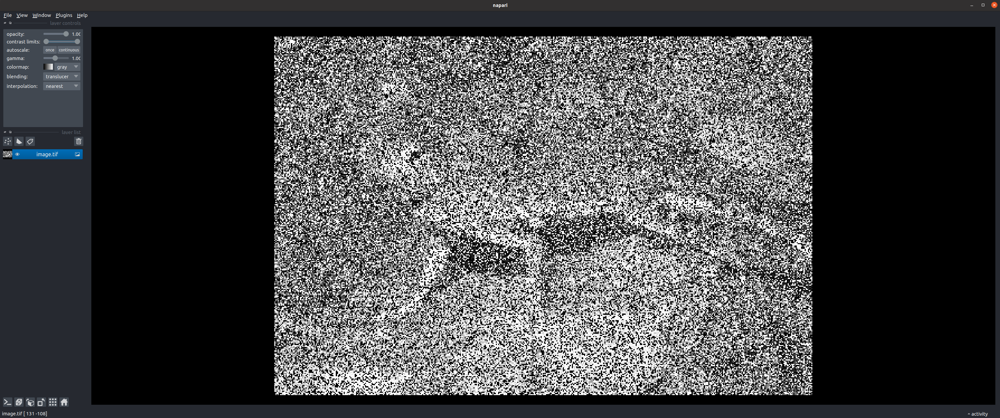

====================
Aydin CLI Tutorials
====================

We have few CLI tutorials below to demonstrate how to use various features
of the CLI Aydin provides.

Checking if Aydin CLI can read and interpret your image right
~~~~~~~~~~~~~~~~~~~~~~~~~~~~~~~~~~~~~~~~~~~~~~~~~~~~~~~~~~~~~~

You can use the following line to get information about how Aydin will be
interpreting their image file.

.. code-block:: bash

   $ aydin info image.tif

   ├╗ Reading image file at: /PATH/TO/IMAGE/image.tif
   │├ Reading file /PATH/TO/IMAGE/image.tif as TIF file
   │├ Metadata:  is_folder=False, ext=tif, axes=YX, shape=(321, 481), batch_axes=(False, False), channel_axes=(False, False), dtype=uint8, format=tif
   │┴« 4.24 milliseconds
   │

Viewing your image with Aydin CLI
~~~~~~~~~~~~~~~~~~~~~~~~~~~~~~~~~~~~~~~~~~~~~~~~~~~~~~~~~~~~

You can use the following line to view their image with help of integrated
napari in Aydin CLI.

.. code-block:: bash

   $ aydin view image.tif

**Note:** `aydin view` command would work as expected only on the machines with
screen access.

Denoising a single image
~~~~~~~~~~~~~~~~~~~~~~~~~

You can use the following line to denoise a single image with default
options.

.. code-block:: bash

   $ aydin denoise image.tif

Denoising a single image with customized options
~~~~~~~~~~~~~~~~~~~~~~~~~~~~~~~~~~~~~~~~~~~~~~~~~~~~~

We have made it possible for users to play with various parameters and options
related to the denoising approach they have chosen and save their specific set
of parameters into a JSON file. We also made it possible to pass such JSON file
to Aydin CLI. One can achieve this as shown below:

.. code-block:: bash

   $ aydin denoise image.tif --lower-level-args=image_options.json

Also we provide the dimensions tab on Aydin Studio where user can select how
Aydin should be treating dimensions of the loaded image.  This is also possible
with Aydin CLI denoise command. An example on how to tell Aydin to treat first
two dimensions of a four-dimensional image as batch dimensions shown below:

.. code-block:: bash

   $ aydin denoise image.tif --batch-axes "[True, True, False, False]"

Denoising a single image with a pre-trained Aydin model
~~~~~~~~~~~~~~~~~~~~~~~~~~~~~~~~~~~~~~~~~~~~~~~~~~~~~~~~~

You can use the following line to denoise a single image with a pre-trained
Aydin model. You can use the Aydin Studio GUI to play with different parameters
and train a model to pass here to the Aydin CLI.

.. code-block:: bash

   $ aydin denoise image.tif --model-path=image_model.zip --use-model

Denoising multiple image files
~~~~~~~~~~~~~~~~~~~~~~~~~~~~~~~~~~~~~~~~~~~~~

You can use the following line to denoise multiple image files with default
options:

.. code-block:: bash

   $ aydin denoise image1.tif image2.tif image3.tif

Or alternatively one can use glob patterns such as:

.. code-block:: bash

   $ aydin denoise image*.tif

Specifying your own output folder
~~~~~~~~~~~~~~~~~~~~~~~~~~~~~~~~~

You can use the following line to specify your desired output folder:

.. code-block:: bash

   $ aydin denoise image.tif --output-folder=/PATH/TO/YOUR/FOLDER

Choosing the denoiser variant
~~~~~~~~~~~~~~~~~~~~~~~~~~~~~~

You can use the following line to denoise a single image
with your choice of denoiser variant.  Use the ``-d`` / ``--denoiser``
flag followed by the variant name:

.. code-block:: bash

   $ aydin denoise image.tif -d noise2selffgr-cb

To see all available denoiser variants, use:

.. code-block:: bash

   $ aydin denoise --list-denoisers

Image Quality Metrics
~~~~~~~~~~~~~~~~~~~~~

Aydin provides commands to compare two images using standard quality metrics.
All metric commands normalise images to [0, 1] before computing.

**SSIM** (Structural Similarity Index):

.. code-block:: bash

   $ aydin ssim reference.tif test.tif

**PSNR** (Peak Signal-to-Noise Ratio):

.. code-block:: bash

   $ aydin psnr reference.tif test.tif

**MSE** (Mean Squared Error):

.. code-block:: bash

   $ aydin mse reference.tif test.tif

Generating Fourier Shell Correlations (FSC) Plot
~~~~~~~~~~~~~~~~~~~~~~~~~~~~~~~~~~~~~~~~~~~~~~~~~~~

You can use the ``fsc`` command to calculate Fourier Shell Correlations
between two images. The result is saved as a plot:

.. code-block:: bash

   $ aydin fsc image1.tif image2.tif

By default the plot is saved to ``fsc.png`` in the current directory.
Use ``-o`` to specify a different output path:

.. code-block:: bash

   $ aydin fsc image1.tif image2.tif -o correlation_plot.png

Splitting channels
~~~~~~~~~~~~~~~~~~~

Split a multi-channel image into separate single-channel files:

.. code-block:: bash

   $ aydin split-channels multichannel.tif

Hyperstacking images
~~~~~~~~~~~~~~~~~~~~~

Stack multiple images into a single higher-dimensional image:

.. code-block:: bash

   $ aydin hyperstack image1.tif image2.tif image3.tif

Citing Aydin
~~~~~~~~~~~~~

Print the citation information for use in publications:

.. code-block:: bash

   $ aydin cite
