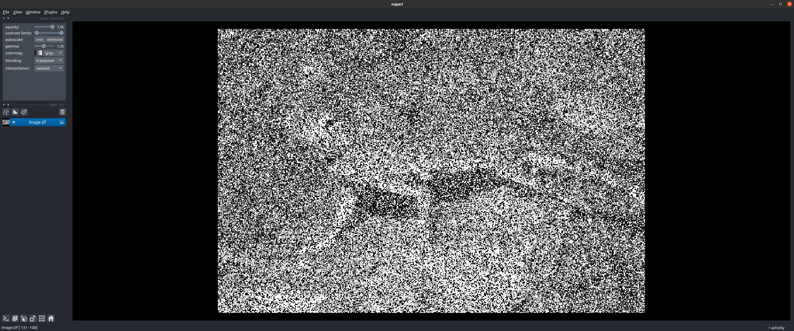

====================
Aydin CLI Tutorials
====================

We have few CLI tutorials below to demonstrate how to use various features
of the CLI Aydin provides.

Checking if Aydin CLI can read and interpret your image right
~~~~~~~~~~~~~~~~~~~~~~~~~~~~~~~~~~~~~~~~~~~~~~~~~~~~~~~~~~~~~~

You can use the following line to get information about how Aydin will be
interpreting their image file.

.. code-block:: bash

   $ aydin info image.tif

   ├╗ Reading image file at: /PATH/TO/IMAGE/image.tif
   │├ Reading file /PATH/TO/IMAGE/image.tif as TIF file
   │├ Metadata:  is_folder=False, ext=tif, axes=YX, shape=(321, 481), batch_axes=(False, False), channel_axes=(False, False), dtype=uint8, format=tif
   │┴« 4.24 milliseconds
   │

Viewing your image with Aydin CLI
~~~~~~~~~~~~~~~~~~~~~~~~~~~~~~~~~~~~~~~~~~~~~~~~~~~~~~~~~~~~

You can use the following line to view their image with help of integrated
napari in Aydin CLI.

.. code-block:: bash

   $ aydin view image.tif

**Note:** `aydin view` command would work as expected only on the machines with
screen access.

Denoising a single image
~~~~~~~~~~~~~~~~~~~~~~~~~

You can use the following line to denoise a single image with default
options.

.. code-block:: bash

   $ aydin denoise image.tif

Denoising a single image with customized options
~~~~~~~~~~~~~~~~~~~~~~~~~~~~~~~~~~~~~~~~~~~~~~~~~~~~~

We have made it possible for users to play with various parameters and options
related to the denoising approach they have chosen and save their specific set
of parameters into a JSON file. We also made it possible to pass such JSON file
to Aydin CLI. One can achieve this as shown below:

.. code-block:: bash

   $ aydin denoise image.tif --lower-level-args=image_options.json

Also we provide the dimensions tab on Aydin Studio where user can select how
Aydin should be treating dimensions of the loaded image.  This is also possible
with Aydin CLI denoise command. An example on how to tell Aydin to treat first
two dimensions of a four-dimensional image as batch dimensions shown below:

.. code-block:: bash

   $ aydin denoise image.tif --batch-axis "[True, True, False, False]"

Denoising a single image with a pre-trained Aydin model
~~~~~~~~~~~~~~~~~~~~~~~~~~~~~~~~~~~~~~~~~~~~~~~~~~~~~~~~~

You can use the following line to denoise a single image with a pre-trained
Aydin model. You can use the Aydin Studio GUI to play with different parameters
and train a model to pass here to the Aydin CLI.

.. code-block:: bash

   $ aydin denoise image.tif --model-path=image_model.zip --use-model

Denoising multiple image files
~~~~~~~~~~~~~~~~~~~~~~~~~~~~~~~~~~~~~~~~~~~~~

You can use the following line to denoise multiple image files with default
options:

.. code-block:: bash

   $ aydin denoise image1.tif image2.tif image3.tif

Or alternatively one can use glob patterns such as:

.. code-block:: bash

   $ aydin denoise image*.tif

Deconvolving a single image
~~~~~~~~~~~~~~~~~~~~~~~~~~~~

You can use the following line to deconvolve a single image with default
options.

.. code-block:: bash

   $ aydin lucyrichardson image.tif

Specifying your own output folder
~~~~~~~~~~~~~~~~~~~~~~~~~~~~~~~~~

You can use the following lines to specify your desired output folder to
Aydin for both denoising and deconvolution runs:

.. code-block:: bash

   $ aydin denoise image.tif --output-folder=/PATH/TO/YOUR/FOLDER
   $ aydin lucyrichardson image.tif  --output-folder=/PATH/TO/YOUR/FOLDER

Using your PSF to deconvolve your image
~~~~~~~~~~~~~~~~~~~~~~~~~~~~~~~~~~~~~~~~~~~~~

You can use the following line to deconvolve a single image with default
options and their own psf. Passed psf file assumed to be a single psf image
in a lossless format.

.. code-block:: bash

   $ aydin lucyrichardson image.tiff psf.tif

Choosing the computational backend
~~~~~~~~~~~~~~~~~~~~~~~~~~~~~~~~~~~~~~~~~~~~~~~~~~~~

You can use the following line to denoise or deconvolve a single image
with their choice of computational backend.

.. code-block:: bash

   $ aydin denoise image.tif --backend="noise2selffgr-nn"
   $ aydin lucyrichardson image.tif --backend="cupy"
