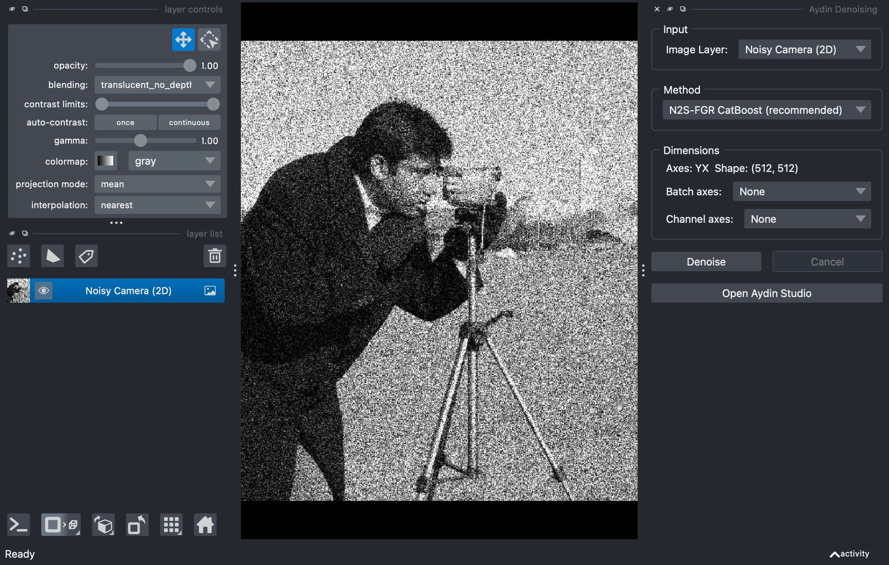

============================
Aydin Napari Plugin
============================

Aydin is available as a `napari <https://napari.org>`_ plugin, letting you denoise images
directly inside the napari viewer.  The plugin provides:

- A **Denoising Widget** with 8 denoising methods
- **Right-click context actions** for one-click denoising
- A bridge to launch the full **Aydin Studio** from napari
- **18 sample datasets** accessible via napari's File menu

Before getting started, make sure ``Aydin`` is :doc:`installed<../getting_started/install>`.

Installation
~~~~~~~~~~~~~~

Installing Aydin automatically registers it as a napari plugin (no extra steps needed):

.. code-block:: bash

   pip install aydin

To verify, open napari and check that **Plugins > Aydin** appears in the menu bar.

.. note::

   Aydin includes ``napari[pyqt6]`` as a dependency, so napari is installed alongside it.
   If you already have napari installed in your environment, Aydin will use the existing
   installation.

Quick Start: Denoising Widget
~~~~~~~~~~~~~~~~~~~~~~~~~~~~~~~~

Open the denoising widget via **Plugins > Aydin > Aydin Denoising Widget**.
The widget docks on the side of the viewer:

The widget has four sections:

**1. Input** -- Select which image layer to denoise from the dropdown.
The list updates automatically as you add or remove layers.

**2. Method** -- Choose a denoising algorithm. Hover over each method for a tooltip
describing its strengths:

.. list-table::
   :header-rows: 1
   :widths: 30 15 55

   * - Method
     - Speed
     - Best for
   * - N2S-FGR CatBoost (recommended)
     - Medium
     - Overall best quality for most images
   * - N2S-FGR LightGBM
     - Medium
     - Similar to CatBoost, sometimes faster on large images
   * - N2S-CNN UNet
     - Slow
     - Complex noise patterns; benefits from GPU
   * - Butterworth (fast)
     - Very fast
     - Periodic noise and smooth structures
   * - Gaussian
     - Very fast
     - Simple baseline for mild noise
   * - Spectral
     - Fast
     - Structured or periodic noise
   * - GM (Gaussian Mixture)
     - Fast
     - Multimodal intensity distributions
   * - Auto (Classic)
     - Fast
     - Auto-selects the best classical method

**3. Dimensions** -- Aydin auto-detects axis labels from napari
(e.g. ``ZYX``, ``TZYX``).  You can override the batch and channel axis
assignments if the auto-detection is incorrect.

**4. Denoise / Cancel** -- Click **Denoise** to start. A progress bar appears
in napari's activity dock.  The denoised image is added as a new layer
named ``<original>_denoised``. Click **Cancel** to abort a running job.

Right-click context actions
~~~~~~~~~~~~~~~~~~~~~~~~~~~~~~

For quick one-click denoising, right-click any image layer in the layer list.
Two Aydin actions are available:

- **Denoise (high quality)** -- Uses the FGR-CatBoost method for best quality
- **Denoise (fast)** -- Uses the Butterworth filter for near-instant results

The denoised image appears as a new layer (``<original>_denoised_hq`` or
``<original>_denoised_fast``).

Launching Aydin Studio from napari
~~~~~~~~~~~~~~~~~~~~~~~~~~~~~~~~~~~~~

For the full Aydin experience with all algorithms, transforms, and fine-grained
parameter control, launch Aydin Studio directly from napari:

- Click **Open Aydin Studio** in the denoising widget, or
- Use the menu: **Plugins > Aydin > Aydin Studio**

Aydin Studio opens as a separate window with your napari layers pre-loaded:

- **Selected layers** are transferred (or all Image layers if none are selected)
- The **Dimensions tab** is pre-populated from napari's axis metadata
- **Denoised results** are pushed back to the same napari viewer when done

This gives you access to all of Aydin's features: pre/post-processing transforms,
training and denoising crops, advanced parameters, model saving, and more.
See the :doc:`Aydin Studio tutorials <gui_tutorials>` for detailed guidance.

Sample data
~~~~~~~~~~~~~~

Aydin provides 18 sample datasets accessible via **File > Open Sample > Aydin**:

**Synthetic samples** (generated instantly, no download):

- Noisy Camera (2D) -- 512 x 512
- Noisy Blobs (3D) -- 64 x 128 x 128

**Microscopy samples** (downloaded from Zenodo on first use, then cached):

.. list-table::
   :header-rows: 1
   :widths: 40 60

   * - Sample
     - Description
   * - New York (noisy)
     - Classic 2D test image
   * - Fountain (noisy)
     - 2D test image
   * - Mona Lisa (noisy)
     - 2D test image
   * - Gauss (noisy)
     - Gaussian noise test
   * - Periodic Noise
     - Periodic noise test
   * - Chessboard (noisy)
     - SIDD benchmark
   * - HCR (Royer)
     - 3D light-sheet microscopy
   * - Blastocyst (Maitre)
     - 3D+t mouse embryo time-lapse
   * - OpenCell ARHGAP21 (Leonetti)
     - Confocal stack
   * - OpenCell ANKRD11 (Leonetti)
     - Confocal stack
   * - Drosophila Egg Chamber (Machado)
     - Confocal microscopy
   * - Fixed Pattern Noise (Huang)
     - 3D with fixed-pattern artifacts
   * - Drosophila 3D (Keller)
     - Light-sheet 3D stack
   * - Fly Brain 3ch (Janelia)
     - 3-channel 3D stack
   * - Tribolium nGFP (Myers)
     - Light-sheet 3D stack
   * - HeLa XYZT (Hyman)
     - XYZT time-lapse

These samples are useful for testing different denoising methods on various image types
and noise characteristics.
